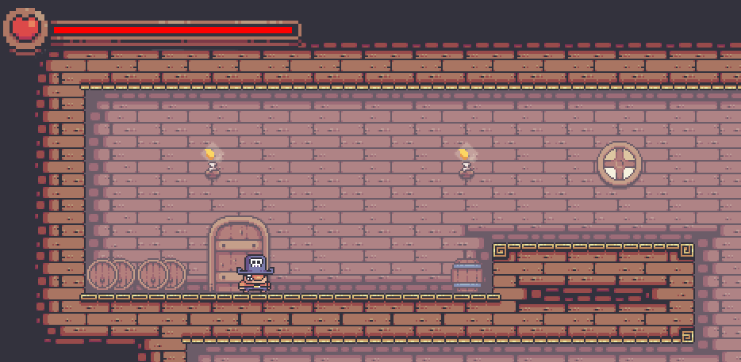
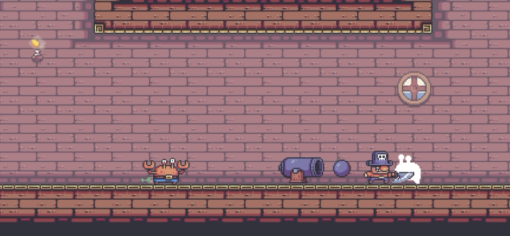
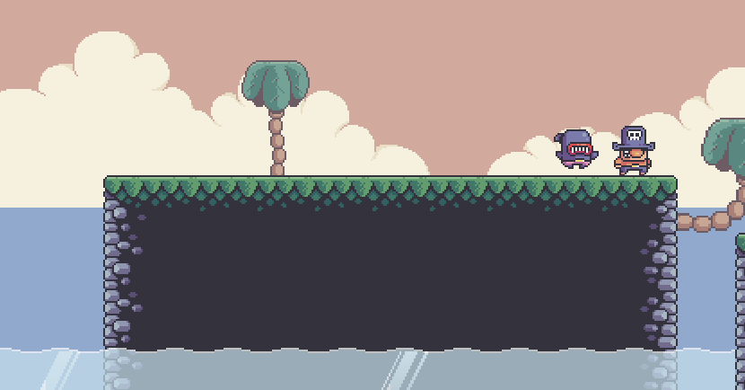
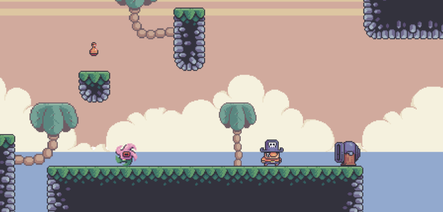

# My first platformer game

  

This project is a simple 2D platformer game developed in Java.
I followed all the video tutorials by the YouTuber [Kaarin Gaming](https://www.youtube.com/watch?v=6_N8QZ47toY&list=LL&index=16), learning how to manage the game engine, animate images, and implement physics.
After completing the tutorials, I decided to rewrite the game from scratch, implementing the various classes in a way that suited my preferences and experience.
The final game is not identical to the one presented in the tutorials; there are additional features as well as some omissions compared to the original.

The textures, characters, and animations used in the game are freely licensed and were created by [Pixel Frog](https://pixelfrog-assets.itch.io/treasure-hunters).
The sound effects and music tracks are also free and were sourced from various online resources. 
The audio effects are managed using the external library TinySound.

## Table of Contents

1. [Introduction](#introduction)
2. [Game Description]()
    - [Objectives](#objectives)
3. [Levels](#levels)
    - [Creating a New Level]()
        - [Red](#red)
        - [Green](#green)
        - [Blue](#blue)

## Game description
The objective of the game is to complete all the levels. Each level can be completed by defeating all the enemies.
To defeat the enemies, the player must collect a sword located at a specific point in the level.
Once all levels are completed, the game returns to the main menu, where the player can start a new game.

  
  

  
  

## Levels
The project currently includes only two levels, but more can be added by following the procedure described below:
### Create a new level

To create a new level, you need to create a .png file and add it to the `src/main/resources/levels/` directory, 
naming it with a numerical identifier starting from 0. Each level is essentially an image where each pixel represents a block in the game.
Depending on the pixel color, the game determines whether to draw a block, spawn an enemy, or place an object.

#### Red
The red color value ranges from 0 to 255 and represents the block in the `src/main/resources/textures/tiles_textures.png` file at the corresponding index.
Transparent spaces correspond to red 255.

#### Green
The green color value ranges from 0 to 255 and is used to spawn an enemy at the pixel's location. There are currently three types of enemies: 
Crab (30), Shark (60), and Starfish (90). 
  <b> Note: </b>   There must be at least one pixel with green = 0 in each level, which identifies the player’s spawn position.   
The level is completed when all enemies are defeated, so there must be at least one enemy present.

#### Blue
The blue color value ranges from 0 to 255 and is used to spawn a Prop in the game.
The list of Props and their corresponding blue values can be found in the `extractProps` method in the `src/main/java/org/example/Levels/Level.java` class.  
<b> Note: <b>   There must be at least one pixel with blue = 50 in each level, which identifies the location of the player's sword.
 
